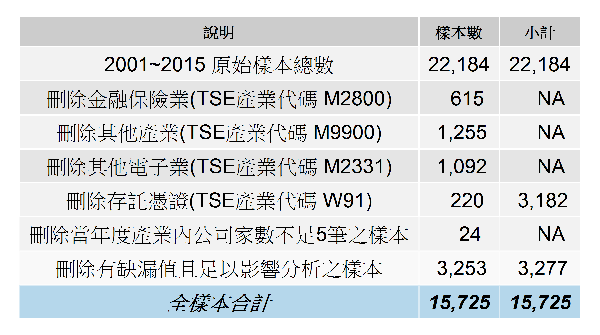
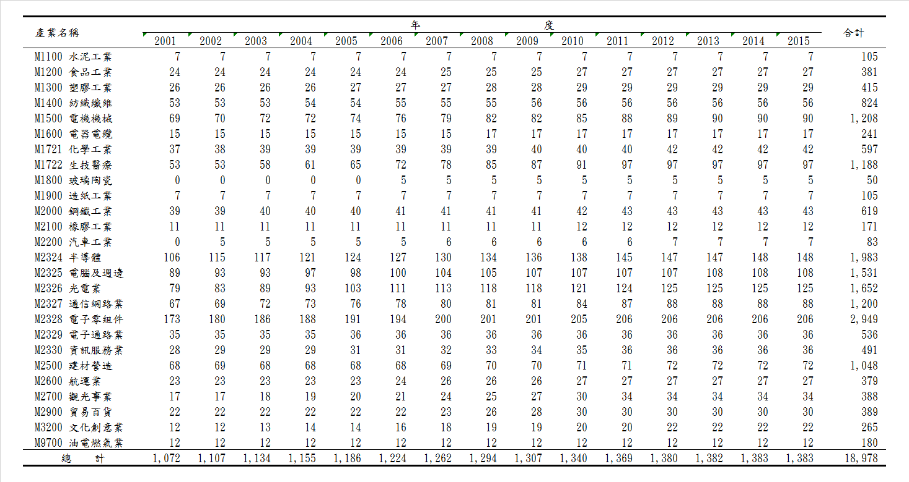

<h1 id="處理論文統計分析過程說明">處理論文統計分析過程說明</h1>

<blockquote>
  
編輯人：鄧孝航  
  聯絡信箱：<a href="402391174@mail.fju.edu.tw">402391174@mail.fju.edu.tw</a>

  
  
內容如有不當煩請告知，謝謝

</blockquote>

為了推廣「可重複研究<strong>(Reproducible Research)</strong>」的概念並方便將來再次研究分析，故建立此說明檔解釋相關的R語言函數及數據處理過程。有關於可重複研究的概念，可參考維基百科<a href="https://en.wikipedia.org/wiki/Reproducibility#Reproducible_research"><strong>(Reproducible Research)</strong></a>。  
本分析使用R語言作為統計分析之工具，並搭配R、Rstudio、Excel、TEJ資料庫。

<blockquote>
  
參考論文： <strong>企業競爭策略與產業競爭程度對避稅行為之影響</strong>  
  作者：<strong>史宗玄</strong>  
  指導教授：<strong>黃美祝 博士</strong>

</blockquote>

本文僅供學術研究之用！

<h2 id="目錄">目錄</h2>

<ul>
<li><a href="#處理論文統計分析過程說明">處理論文統計分析過程說明</a><ul>
<li><a href="#目錄">目錄</a></li>
<li><a href="#運行前的準備">運行前的準備</a></li>
<li><a href="#實證分析">實證分析</a><ul>
<li><a href="#架構">架構</a></li>
<li><a href="#getting-data">Getting Data</a></li>
<li><a href="#preparation-for-rstudio">Preparation for RStudio</a></li>
<li><a href="#preparing-data">Preparing Data</a></li>
<li><a href="#analyze">Analyze</a></li>
<li><a href="#produce-reports-and-graphs">Produce reports and graphs</a><ul>
<li><a href="#樣本說明">樣本說明</a><ul>
<li><a href="#表一樣本篩選表">表一、樣本篩選表</a></li>
<li><a href="#表二樣本產業與年度分配表">表二、樣本產業與年度分配表</a></li>
<li><a href="#表0按產業年份及變數分類之缺漏值數量表">表0、按產業、年份及變數分類之缺漏值數量表</a></li>
</ul>
</li>
<li><a href="#敘述統計">敘述統計</a><ul>
<li><a href="#表三各變數敘述統計量">表三、各變數敘述統計量</a></li>
<li><a href="#表四各產業之市場分類結構">表四、各產業之市場分類結構</a></li>
</ul>
</li>
<li><a href="#相關係數分析">相關係數分析</a><ul>
<li><a href="#表五各變數之pearson相關係數表以etr為應變數">表五、各變數之Pearson相關係數表(以ETR為應變數)</a></li>
<li><a href="#表六各變數之pearson相關係數表以cashetr為應變數">表六、各變數之Pearson相關係數表(以CashETR為應變數)</a></li>
<li><a href="#表七實證結果表">表七、實證結果表</a></li>
</ul>
</li>
</ul>
</li>
<li><a href="#explain">Explain</a></li>
<li><a href="#functions">Functions</a><ul>
<li><a href="#所有自定義函數說明如下">所有自定義函數說明如下</a><ul>
<li><a href="#installpack">Install.pack</a></li>
<li><a href="#loadpack">Load.pack</a></li>
<li><a href="#readdb">readDB</a></li>
<li><a href="#dbfilter">DBfilter</a></li>
<li><a href="#nato0">NAto0</a></li>
<li><a href="#controlvar">control_var</a></li>
<li><a href="#expvarstr">exp_var_STR</a></li>
<li><a href="#depvar">dep_var</a></li>
<li><a href="#str">STR</a></li>
<li><a href="#strrank">STRrank</a></li>
<li><a href="#fngdp">fnGDP</a></li>
<li><a href="#fnhhi">fnHHI</a></li>
<li><a href="#winsorizedsample">winsorized.sample</a></li>
<li><a href="#winsamp1">winsamp1</a></li>
<li><a href="#winsamp2">winsamp2</a></li>
<li><a href="#plottba1">plottbA1</a></li>
</ul>
</li>
<li><a href="#套件函數說明如下">套件函數說明如下</a><ul>
<li><a href="#installpack-1">Install.pack</a></li>
<li><a href="#installpack-2">Install.pack</a></li>
<li><a href="#installpack-3">Install.pack</a></li>
<li><a href="#installpack-4">Install.pack</a></li>
<li><a href="#installpack-5">Install.pack</a></li>
</ul>
</li>
</ul>
</li>
</ul>
</li>
<li><a href="#qa">Q&amp;A</a><ul>
<li><a href="#如何開啟tej增益集">如何開啟TEJ增益集?</a></li>
<li><a href="#自記錄檔匯入tej設定">自記錄檔匯入TEJ設定</a></li>
<li><a href="#出現failed-with-error-package-rjava-could-not-be-loaded">出現Failed with error: ‘package ‘rJava’ could not be loaded’</a></li>
<li><a href="#q4">Q4</a></li>
<li><a href="#q5">Q5</a></li>
<li><a href="#q6">Q6</a></li>
</ul>
</li>
<li><a href="#後記">後記</a></li>
<li><a href="#引用文獻">引用文獻</a></li>
<li><a href="#r說明檔-official-guide">R說明檔 (official guide)</a><ul>
<li><ul>
<li><a href="#套件函數說明如下-1">套件函數說明如下</a><ul>
<li><a href="#installpack-2-1">Install.pack</a></li>
<li><a href="#installpack-3-1">Install.pack</a></li>
<li><a href="#installpack-4-1">Install.pack</a></li>
<li><a href="#installpack-5-1">Install.pack</a></li>
<li><a href="#installpack-6">Install.pack</a></li>
</ul>
</li>
</ul>
</li>
</ul>
</li>
<li><a href="#qa-1">Q&amp;A</a><ul>
<li><a href="#如何開啟tej增益集-1">如何開啟TEJ增益集?</a></li>
<li><a href="#自記錄檔匯入tej設定-1">自記錄檔匯入TEJ設定</a></li>
<li><a href="#rjavaerror">出現Failed with error:  ‘package ‘rJava’ could not be loaded’</a></li>
<li><a href="#q4-1">Q4</a></li>
<li><a href="#q5-1">Q5</a></li>
<li><a href="#q6-1">Q6</a></li>
</ul>
</li>
<li><a href="#後記-1">後記</a></li>
<li><a href="#引用文獻-1">引用文獻</a></li>
<li><a href="#r說明檔-official-guide-1">R說明檔 (official guide)</a></li>
</ul>
</li>
</ul>

<h2 id="運行前的準備">運行前的準備</h2>

欲建立運行環境，請先至<a href="https://cran.r-project.org/mirrors.html">R的網站</a>下載新版的R安裝。

<blockquote>
  <ol>
  <li>使用<kbd>Ctrl+F</kbd>搜尋<strong>Taiwan</strong>，並任選一鏡像下載點，或直接<a href="http://ftp.yzu.edu.tw/CRAN/">點此下載</a>。</li>
  <li>請選擇適合自己電腦運行介面的版本，R提供Linux, Mac及Windows三種版本。</li>
  <li>R支援多國語言，從哪個鏡像下載不影響安裝。</li>
  <li>建議版本需<strong>3.3.0</strong>以後。</li>
  </ol>
</blockquote>

再至<a href="https://www.rstudio.com/">Rstudio官網</a>下載主程式安裝，或<a href="https://www.rstudio.com/products/rstudio/download/">點此</a>至下載頁面。

<blockquote>
  
Rstudio載點快速連結：(<strong>0.99.902</strong>版，於2016/5/14更新)  
   1. <a href="https://download1.rstudio.org/RStudio-0.99.902.exe">Windows Vista/7/8/10</a>  
   2. <a href="https://download1.rstudio.org/RStudio-0.99.902.dmg">Mac OS X 10.6+ (64-bit)</a>  
   3. <a href="https://download1.rstudio.org/rstudio-0.99.902-amd64.deb">Ubuntu 12.04+/Debian 8+ (64-bit)</a>

</blockquote>

安裝完成後，請確認Rstudio或RGui之語言及區域(language &amp; locale)設定正確：

<pre><code># 查看環境設定
sessionInfo()
# 查看語言/地區設定
Sys.getlocale(category = "LC_ALL")
[1]"LC_COLLATE=Chinese (Traditional)_Taiwan.950;LC_MONETARY=Chinese (Traditional)_Taiwan.950;LC_NUMERIC=C;LC_TIME=Chinese (Traditional)_Taiwan.950"
# 若上述回傳非顯示相同值，請輸入下方設定
Sys.setlocale("LC_ALL",locale='cht')
</code></pre>

其他疑難排解，請見手冊：  
<a href="https://github.com/dspim/R/wiki/R-&amp;-RStudio-Troubleshooting-Guide">https://github.com/dspim/R/wiki/R-&amp;-RStudio-Troubleshooting-Guide</a>

<h2 id="實證分析"><strong>實證分析</strong></h2>

<h3 id="架構"><strong>架構</strong></h3>

<blockquote>
  <ol>
  <li>TEJ資料庫抓取資料建立分析資料庫。<strong>(Getting Data)</strong></li>
  <li>整理資料至可使用程度(排除不需要的欄位)。<strong>(Preparing Data)</strong></li>
  <li>產生虛擬變數及可供分析建模的變數。<strong>(Produce Variables)</strong></li>
  <li>以線性多變量回歸模型分析資料，並製作相關分析表。<strong>(Analyze)</strong></li>
  <li>產生報表。<strong>(Produce reports and graphs)</strong></li>
  <li>解釋分析結果。<strong>(Explain)</strong></li>
  </ol>
</blockquote>

<h3 id="getting-data"><strong>Getting Data</strong></h3>

<blockquote>
  <ol>
  <li>開啟Excel，使用TEJ的Excel增益集。 <a href="#如何開啟tej增益集">(如何開啟TEJ增益集?)</a></li>
  <li>讀入記錄檔.dat，可以得到本分析資料庫的原始設定。</li>
  <li>運行RStudio</li>
  </ol>
</blockquote>

<h3 id="preparation-for-rstudio"><strong>Preparation for RStudio</strong></h3>

<blockquote>
  
#清除環境清單  
  <code>rm(list=ls())</code> 

  
  
#設定工作資料夾(EX: C:\Users\User\Desktop\Code)  
  <code>setwd("C:\\Users\\User\\Desktop\\Code")</code>

  
  
#讀入函數庫  
  <code>source('functions.R',encoding='utf-8')</code>

  
  
#安裝所有未安裝之套件  
  <code>Install.pack()</code>   
  <a href="#installpack">Install.pack</a> 說明

  
  
#讀入所有需要之套件  
  <code>Load.pack()</code>   
  <a href="#loadpack">Load.pack</a> 說明

  
  
#擷取工作路徑，用於之後輸出資料庫  
  <code>wd &lt;- getwd()</code> 

</blockquote>

<h3 id="preparing-data"><strong>Preparing Data</strong></h3>

<ol>
<li>
讀入自TEJ下載的<a href="https://github.com/Oscar-Deng/EssayCoding2016/blob/master/DB2.xlsx">excel檔</a>，並命名為<code>TEJ</code>資料集。

<code>TEJ &lt;- readDB(fil = "DB2.xlsx", attr_sht = "TEJ_attr", xls_sht = "TEJ")</code>  
<a href="#readdb">readDB</a> 說明
</li>
<li>
篩選資料集TEJ，並命為<code>TEJ0</code>，同時將篩選掉的資料集另命為<code>TEJ01</code>。

<code>TEJ01 &lt;- DBfilter(x = TEJ,filt = 'filtered')</code>  
<code>TEJ02 &lt;- DBfilter(x = TEJ,filt = 'dropped')</code>  
<a href="#dbfilter">DBfilter</a> 說明
</li>
<li>
缺漏值補0。

# 補0欄位：  
<code>TEJ1&lt;-NAto0(x='TEJ01',col=c('OERD','OEPRO','Land','LandR',</code>  
<code>'CTP_IFRS_CFI','CTP_IFRS_CFO','CTP_IFRS_CFF','CTP_GAAP'))</code>  
<a href="#nato0">NAto0</a> 說明
</li>
<li>
產生控制變數。

<code>TEJ2 &lt;- control_var(x=TEJ1)</code>  
<a href="#controlvar">control_var</a>說明
</li>
<li>
產生解釋變數。

<code>TEJ3 &lt;- exp_var_STR(x=TEJ2)</code>  
<a href="#expvarstr">exp_var_STR</a>說明
</li>
<li>
產生依變數。

<code>TEJ4 &lt;- dep_var(TEJ3,k=5)</code>  
<a href="#depvar">dep_var</a>說明
</li>
<li>
產生<code>企業競爭策略</code> <strong>(STRATEGY)</strong>變數

<code>TEJ5 &lt;- STR(TEJ4)</code>  
<code>TEJ6 &lt;- STRrank(TEJ5)</code>  
<a href="#str">STR</a>說明  
<a href="#strrank">STRrank</a>說明
</li>
<li>
產生賀芬達指標(虛擬變數) <strong>HHI</strong>

<code>TEJ7 &lt;- fnHHI(TEJ6)</code>  
<a href="#fnhhi">fnHHI</a>說明
</li>
<li>
極值調整winsorizing

# winsor套件  
<code>TEJ81 &lt;- TEJ7</code>  
<code>TEJ81 &lt;- winsamp1(x='TEJ81',col=c('ETR','CETR','ROA','SIZE','LEV','INTANG','QUICK',</code>  
  <code>'EQINC','OUTINSTI','RELATIN','RELATOUT')</code>  
  <code>,prob=0.01,na.rm=TRUE)</code>  
<a href="#winsamp1">winsamp1</a> 說明

# 自定義winsorize函數  
TEJ82 &lt;- TEJ7  
TEJ82 &lt;- winsamp2(x=’TEJ82’,col = c(‘ETR’,’CETR’,’ROA’,’SIZE’,’LEV’,’INTANG’,’QUICK’,  
  ‘EQINC’,’OUTINSTI’,’RELATIN’,’RELATOUT’),  
  prob = 0.01)  
<a href="#winsamp2">winsamp2</a> 說明
</li>
<li>
取需要欄位以便建模

<code>TEJ91 &lt;- catchDB(x=TEJ81)</code>  
<code>TEJ92 &lt;- catchDB(x=TEJ82)</code>  
<a href="#catchdb">catchDB</a> 說明
</li>
<li>
併入GDP值

<code>TEJ101 &lt;- fnGDP(x=TEJ91,file="DB2.xlsx",col_sht="GDP_colnames",DB_sht="GDP")</code>  
<code>TEJ102 &lt;- fnGDP(x=TEJ92,file="DB2.xlsx",col_sht="GDP_colnames",DB_sht="GDP")</code>  
<a href="#fngdp">fnGDP</a> 說明
</li>
<li>
建立線性模型

<code>lm()</code>  
<a href="#lm">lm</a> 說明
</li>
<li>
匯出結果及所有資料表

<code>source('output.R',encoding='utf-8')</code>  
<code>outputcsv()</code>  
<a href="#outputcsv">outputcsv</a> 說明
</li>
<li>
若所有結果執行無誤，則回傳”執行完畢”。

<code>print("Finished running 'run2.R' !")</code>
</li>
</ol>

<h3 id="analyze"><strong>Analyze</strong></h3>

<h3 id="produce-reports-and-graphs"><strong>Produce reports and graphs</strong></h3>

<h4 id="樣本說明">樣本說明</h4>

<h5 id="表一樣本篩選表">表一、樣本篩選表</h5>

<pre><code>tbA1 &lt;- plottbA1()
</code></pre>

<a href="#plottba1">plottbA1</a> 說明  

<h5 id="表二樣本產業與年度分配表">表二、樣本產業與年度分配表</h5>

<pre><code>TEJ102$TSE &lt;- paste(TEJ102$TSE_code,TEJ102$TSE_name,sep=" ")
tbA2 &lt;- as.data.frame.matrix(table(TEJ102$TSE,TEJ102$year))
grid.table(tbA2)
</code></pre>

<strong>另以EXCEL編輯</strong>  

<h5 id="表0按產業年份及變數分類之缺漏值數量表">表0、按產業、年份及變數分類之缺漏值數量表</h5>

<blockquote>
  
<code></code>

</blockquote>

<h4 id="敘述統計">敘述統計</h4>

<h5 id="表三各變數敘述統計量">表三、各變數敘述統計量</h5>

<blockquote>
  
<code></code>

</blockquote>

<h5 id="表四各產業之市場分類結構">表四、各產業之市場分類結構</h5>

<blockquote>
  
<code></code>

</blockquote>

<h4 id="相關係數分析">相關係數分析</h4>

<h5 id="表五各變數之pearson相關係數表以etr為應變數">表五、各變數之Pearson相關係數表(以ETR為應變數)</h5>

<blockquote>
  
<code></code>

</blockquote>

<h5 id="表六各變數之pearson相關係數表以cashetr為應變數">表六、各變數之Pearson相關係數表(以CashETR為應變數)</h5>

<blockquote>
  
<code></code>

</blockquote>

<h5 id="表七實證結果表">表七、實證結果表</h5>

<ul>
<li>
無STRATEGY × HHI變數 <code>(STR_HHI)</code>

<blockquote>
  
<code></code> 

</blockquote></li>
<li>
有STRATEGY × HHI變數 <code>(STR_HHI)</code>

<blockquote>
  
<code></code> 

</blockquote></li>
</ul>

<h3 id="explain"><strong>Explain</strong></h3>

<blockquote>
  
<code>解釋</code>

</blockquote>

<h3 id="functions"><strong>Functions</strong></h3>

<h4 id="所有自定義函數說明如下">所有自定義函數說明如下</h4>

<h5 id="installpack"><strong>Install.pack</strong></h5>

<pre><code># 檢查並安裝所有**未安裝**的套件
Install.pack&lt;-function(list=c("readxl","xlsx","data.table","plyr","dplyr","knitr","gridExtra","ggplot2","zoo","R.oo","R.utils","psych","robustHD")){
list.of.packages &lt;- list
new.packages&lt;-list.of.packages[!(list.of.packages %in% installed.packages()[,"Package"])]
if(length(new.packages))install.packages(new.packages)}else{update.packages(list.of.packages)}
}
</code></pre>

# list列出所有用到的套件：

<blockquote>
  <ul>
  <li>readxl：讀入excel檔</li>
  <li>xlsx：讀寫excel檔</li>
  <li>data.table：資料集套件</li>
  <li>plyr：文字處理套件</li>
  <li>dplyr：文字處理套件</li>
  <li>knitr：文字處理套件</li>
  <li>gridExtra：表格處理套件</li>
  <li>ggplot2：繪圖套件</li>
  <li>R.oo：物件導向編程套件</li>
  <li>zoo：時序套件</li>
  <li>R.utils：雜項編程套件</li>
  <li>psych：心理學研究套件，使用其中的統計分析函數</li>
  <li>robustHD：統計分析套件</li>
  </ul>
</blockquote>

<h5 id="loadpack"><strong>Load.pack</strong></h5>

<pre><code># 讀入所有使用到的套件
Load.pack &lt;- function(lst=list("readxl","xlsx","data.table","plyr","dplyr","knitr","gridExtra","ggplot2","zoo","R.oo","R.utils","psych","robustHD")){
lapply(lst, require, character.only = TRUE)
}
</code></pre>

<h5 id="readdb"><strong>readDB</strong></h5>

<pre><code># 讀入excel檔，並重新命名欄位 
readDB &lt;- function(fil = "DB2.xlsx", attr_sht = "TEJ_attr", xls_sht = "TEJ"){
# 讀入檔案：DB2.xlsx，工作表：TEJ_attr，有新舊欄位名稱及欄位屬性
DBattr &lt;- read_excel(fil, sheet=attr_sht, col_names = TRUE)
# 讀入檔案：DB2.xlsx，工作表：TEJ，包含欄位屬性
DBori &lt;- read_excel(fil, sheet=xls_sht, col_names = TRUE, col_types = DBattr$attr)
# 重設欄位名稱為新名稱
setnames(DBori,old=as.character(DBattr$old), new=as.character(DBattr$new))
}
</code></pre>

<h5 id="dbfilter"><strong>DBfilter</strong></h5>

<pre><code># 篩選資料集函數
DBfilter &lt;- function(x = TEJ,filt='filtered'){
  # 原始資料─DB，data.table型態：
DB &lt;- as.data.table(x)
  # 新增年份欄位
DB$year &lt;- year(DB$date)
DB0 &lt;- DB[,.SD[.N  0],by=list(TSE_code,year)]
# 篩選1：
  ##以**TSE新產業類別**分類，去除**金融保險(M2800)**、**其他(M9900)**、**其他電子(M2331)**、**存託憑證(W91)**
DB1 &lt;- DB0[!(DB0$TSE_code %in% c('M2800','M9900','M2331','W91'))]
# 篩選2：當年度產業不足五家公司的─DB1：
DB2 &lt;- DB1[,.SD[.N = 5],by=list(TSE_code,year)]
# 篩選3：
  ##刪除FAMILY(家族企業)缺漏值
DB3 &lt;- DB2[!(DB2$FAMILY %in% NA) &amp;
  ##刪除PB(市價)缺漏值
!(DB2$PB %in% NA) &amp; # 重要指標，不能是NA。
  ##刪除TA(資產總額)缺漏值
!(DB2$TA %in% NA) &amp; # 是PPE, ROA, SIZE, LEV, INTANG的分母，不能是NA。
  ##刪除NetSales(營業收入淨額)缺漏值、0值
!(DB2$NetSales %in% c(0,NA)) &amp; # 是RD,EMP,MARKET的分母，不能是NA。
  ##刪除employee(員工人數)缺漏值
!(DB2$employee %in% NA)]
DB4 &lt;- rbind(DB0,DB3)
DB4 &lt;- DB4[order(DB4$TSE_code,DB4$year),]
DB5 &lt;- DB4[!(duplicated(DB4) | duplicated(DB4, fromLast = TRUE)),]

  # 若filt='filtered'，回傳篩選後的資料集，若filt='dropped'，回傳篩選掉的資料集。
    base::ifelse(filt=='filtered', return(DB2), base::ifelse(filt=='dropped', return(DB5), print("please assign filter type")))
    }
</code></pre>

<h5 id="nato0"><strong>NAto0</strong></h5>

<pre><code># 補NA為0 ─ 將欲補0的欄位放入col，如：`col=c('OERD','OEPRO','Land','LandR','RELATIN'))`

NAto0 &lt;- function(x = 'TEJ01',col=c(NA)){
  x1 &lt;- captureOutput(
    for(y in col){cat(x,'$',y,'[is.na(',x,'$',y,')] &lt;- 0',sep="",fill = TRUE)})
  x2 &lt;- captureOutput(cat('return(',paste(x),')',sep=""))
  xx &lt;- c(x1,x2)
  eval(base::parse(text=xx))}
</code></pre>

<h5 id="controlvar"><strong>control_var</strong></h5>

<pre><code># 產生控制變數
control_var &lt;- function(x=TEJ1){
  y &lt;- transform(x,
    ROA = as.numeric(PTEBX) / as.numeric(TA), # ROA : NetSales / TotalAssets
    SIZE = as.numeric(log(x = as.numeric(TA), base = exp(1))), # SIZE : ln(TA)
    LEV = as.numeric(TL) / as.numeric(TA), # LEV : TL / TA
    INTANG = as.numeric(INTAN) / as.numeric(TA), # INTANG : intangible assets / TA
    QUICK = ifelse(is.na(QUICK),0,as.numeric(QUICK)), # QUICK : = QUICK
    EQINC = as.numeric(-(InvIn + InvLoss)) / as.numeric(TA), # EQINC : (InvIn + InvLos) / -TA
    OUTINSTI = ifelse(is.na(OUTINSTI),0,as.numeric(OUTINSTI)), # OUTINSTI : = OUTINSTI
    RELATIN = ifelse(is.na(RELATIN),0,as.numeric(RELATIN)),
    RELATOUT = ifelse(is.na(RELATOUT),0,as.numeric(RELATOUT)),
    FAM_Dum = ifelse(FAMILY == 'F', 1, 0)
  )
  DB &lt;- as.data.table(y[order(y$company,y$year),]) 
  return(DB)}
</code></pre>

<h5 id="expvarstr"><strong>exp_var_STR</strong></h5>

<pre><code>exp_var_STR &lt;- function(x=TEJ1){
  y &lt;- transform(x,
    CTP_IFRS = as.numeric(-(CTP_IFRS_CFI + CTP_IFRS_CFO + CTP_IFRS_CFF)),
    STR_RD = as.numeric(OERD) / as.numeric(NetSales),
    STR_EMP = as.numeric(employee) / as.numeric(NetSales),
    STR_MB = as.numeric(PB),
    STR_MARKET = as.numeric(OEPRO) / as.numeric(NetSales),
    STR_PPE = as.numeric( FA - Land - LandR ) / as.numeric(TA)
  )
  z &lt;- transform(y, CTP = ifelse(year &gt;= 2012,CTP_IFRS,CTP_GAAP)) 
  DB &lt;- as.data.table(z[order(z$company,z$year),]) # sort by company&lt;ascending&gt; and year&lt;ascending&gt;
  return(DB)}
</code></pre>

<h5 id="depvar"><strong>dep_var</strong></h5>

<pre><code>dep_var &lt;- function(x=TEJ2,k=5){
  DB01 &lt;- x[,.SD[.N &gt;= k],by=company]
  DB02 &lt;- x[,.SD[.N &lt; k],by=company]
  DB1 &lt;- DB01[,`:=`(BTE5yrsum = rollapplyr(BTE, width = 5, FUN = sum, fill = NA),
                    CTP5yrsum = rollapplyr(CTP, width = 5, FUN = sum, fill = NA),
                    PTEBX5yrsum = rollapplyr(PTEBX, width = 5, FUN = sum, fill = NA)),
              by=company]
  DB2 &lt;- DB02[,`:=`(BTE5yrsum = NA,CTP5yrsum = NA,PTEBX5yrsum = NA),by=company]
  DB3 &lt;- rbind(DB1,DB2)
  DB &lt;- transform(DB3,
                  ETR = as.numeric(BTE5yrsum) / as.numeric(PTEBX5yrsum),
                  CETR = as.numeric(CTP5yrsum) / as.numeric(PTEBX5yrsum))
  return(as.data.table(DB[order(DB$company,DB$year),]))}
</code></pre>

<h5 id="str"><strong>STR</strong></h5>

<pre><code>STR &lt;- function(x=TEJ4) {
  x &lt;- x[order(x$company,x$year),]
  rollmn &lt;- function(x) rollapplyr(x, width, function(x) mean(x, na.rm = TRUE), fill=NA)
  mkdt &lt;- capture.output(for(i in 1:15){
    cat('DB',i,"&lt;- x[,.SD[.N==",i,"],by=company]",sep="",fill=TRUE)
    if(i&gt;5){cat("width &lt;- list(numeric(0),-1,-(1:2),-(1:3),-(1:4)",rep(',-(1:5)',i-5),')',sep="",fill=TRUE)}
    if(i==5){cat("width &lt;- list(numeric(0),-1,-(1:2),-(1:3),-(1:4)",')',sep="",fill=TRUE)}
    if(i==4){cat("width &lt;- list(numeric(0),-1,-(1:2),-(1:3)",')',sep="",fill=TRUE)}
    if(i==3){cat("width &lt;- list(numeric(0),-1,-(1:2)",')',sep="",fill=TRUE)}
    if(i==2){cat("width &lt;- list(numeric(0),-1",')',sep="",fill=TRUE)}
    if(i==1){cat("width &lt;- numeric(0)",sep="",fill=TRUE)}
    cat('DB',i,'&lt;-transform(DB',i, 
        #cat(
        ",STR_RD_mean = ave(STR_RD, company, FUN=rollmn),STR_EMP_mean = ave(STR_EMP, company, FUN=rollmn),STR_MB_mean = ave(STR_MB, company, FUN=rollmn),STR_MARKET_mean = ave(STR_MARKET, company, FUN=rollmn),STR_PPE_mean = ave(STR_PPE, company, FUN=rollmn))",sep="",fill=TRUE)
  })
  eval(base::parse(text=mkdt))
  DT &lt;- rbind(DB1,DB2,DB3,DB4,DB5,DB6,DB7,DB8,DB9,DB10,DB11,DB12,DB13,DB14,DB15)
  NAto0 &lt;- function(x = 'DT',col=c('STR_RD_mean','STR_EMP_mean','STR_MB_mean','STR_MARKET_mean','STR_PPE_mean')){
    x1 &lt;- captureOutput(
      for(y in col){cat(x,'$',y,'[is.nan(',x,'$',y,')] &lt;- 0',sep="",fill = TRUE)})
    x2 &lt;- captureOutput(cat('return(',paste(x),')',sep=""))
    xx &lt;- c(x1,x2)
    eval(base::parse(text=xx))} # replace NA with 0.
  DT1 &lt;- NAto0()
  DBA &lt;- as.data.table(DT1[order(DT1$company,DT1$year),])
  return(DBA)
}
</code></pre>

<h5 id="strrank"><strong>STRrank</strong></h5>

<pre><code>STRrank &lt;- function(x=TEJ5){
  prank&lt;-function(x) {ifelse(is.na(x),NA,rank(x,ties.method = 'min')/sum(!is.na(x)))} # STRATEGY ranktile.
  rankscore &lt;- function(x) ifelse(x&gt;=0 &amp; x&lt;=0.2,1,ifelse(x&gt;0.2 &amp; x&lt;=0.4,2,ifelse(x&gt;0.4 &amp; x&lt;=0.6,3,ifelse(x&gt;0.6 &amp; x&lt;=0.8,4,ifelse(x&gt;0.8 &amp; x&lt;=1,5,NA)))))
  DB &lt;- transform(x[,by=c(TSE_code,year)],
                  STR_RD_mean_rank = prank(STR_RD_mean),
                  STR_EMP_mean_rank = prank(STR_EMP_mean),
                  STR_MB_mean_rank = prank(STR_MB_mean),
                  STR_MARKET_mean_rank = prank(STR_MARKET_mean),
                  STR_PPE_mean_rank = prank(STR_PPE_mean))
  DB2 &lt;- transform(DB,
                   RD = rankscore(STR_RD_mean_rank),
                   EMP = rankscore(STR_EMP_mean_rank),
                   MB = rankscore(STR_MB_mean_rank),
                   MARKET = rankscore(STR_MARKET_mean_rank),
                   PPE = rankscore(STR_PPE_mean_rank))
  DB2$STR &lt;- as.numeric(DB2$RD) + as.numeric(DB2$EMP) + as.numeric(DB2$MB) + as.numeric(DB2$MARKET) + as.numeric(DB2$PPE)
  return(DB2)}
</code></pre>

<h5 id="fngdp"><strong>fnGDP</strong></h5>

<pre><code>fnGDP &lt;- function(x=TEJ91,file="DB2.xlsx",col_sht="GDP_colnames",DB_sht="GDP"){
  GDP_colname &lt;- read_excel(file, sheet=col_sht)
  rGDP &lt;- read_excel(file, sheet=DB_sht)
  setnames(rGDP, old=as.character(GDP_colname$old), new=as.character(GDP_colname$new))
  rGDP$year &lt;- year(rGDP$Date)
  rGDP$GDP &lt;- log(rGDP$Value,base=exp(1))
  GDP &lt;- subset(rGDP,select=c(year,GDP))
  return(merge(x,GDP,by="year"))}
</code></pre>

<h5 id="fnhhi"><strong>fnHHI</strong></h5>

<pre><code>fnHHI &lt;- function(x=TEJ6) {
  func &lt;- function(z=y2) {
    rollmn &lt;- function(x) rollapplyr(x, width, function(x) mean(x, na.rm = TRUE), fill=NA)
    mkdt &lt;- capture.output(for(i in 1:15){
      cat('DB',i,"&lt;- z[,.SD[.N==",i,"],by=TSE_code]",sep="",fill=TRUE)
      if(i&gt;5){cat("width &lt;- list(numeric(0),-1,-(1:2),-(1:3),-(1:4)",rep(',-(1:5)',i-5),')',sep="",fill=TRUE)}
      if(i==5){cat("width &lt;- list(numeric(0),-1,-(1:2),-(1:3),-(1:4)",')',sep="",fill=TRUE)}
      if(i==4){cat("width &lt;- list(numeric(0),-1,-(1:2),-(1:3)",')',sep="",fill=TRUE)}
      if(i==3){cat("width &lt;- list(numeric(0),-1,-(1:2)",')',sep="",fill=TRUE)}
      if(i==2){cat("width &lt;- list(numeric(0),-1",')',sep="",fill=TRUE)}
      if(i==1){cat("width &lt;- numeric(0)",sep="",fill=TRUE)}
      cat('DB',i,'&lt;-transform(DB',i, ",HHI = ave(HHIsum, TSE_code, FUN=rollmn))",sep="",fill=TRUE)
    })
    eval(base::parse(text=mkdt))
    DT &lt;- rbind(DB1,DB2,DB3,DB4,DB5,DB6,DB7,DB8,DB9,DB10,DB11,DB12,DB13,DB14,DB15)
    return(DT)
  }
  x1 &lt;- x[,NSsum := sum(NetSales,na.rm = TRUE),by=list(TSE_code,year)]
  x2 &lt;- x1[,NSalpha2 := (as.numeric(NetSales) / as.numeric(NSsum))^2 ]
  x3 &lt;- x2[,HHIsum := sum(NSalpha2,na.rm = TRUE),by=list(TSE_code,year)]
  y1 &lt;- subset(x3,select=c(TSE_code,year,HHIsum))
  y2 &lt;- y1[!duplicated(y1)][order(TSE_code, year),]
  y3 &lt;- func(y2)
  y4 &lt;- subset(y3,select=c(TSE_code,year,HHI))
  z1 &lt;- merge(x3,y4,by=c("TSE_code","year"))
  z1$HHI &lt;- ifelse(is.nan(z1$HHI),as.numeric(NA),as.numeric(z1$HHI))
  z1$HHI_mark &lt;- ifelse(z1$HHI &lt; 0.1,1,0)
  DB &lt;- transform(z1, STR_HHI = as.numeric(STR * HHI_mark))
  #DBA &lt;- DB[order(TSE_code,year,company)]
  return(DB)
}
</code></pre>

&lt;&lt;&lt;&lt;&lt;&lt;&lt; HEAD

<h5 id="winsorizedsample"><strong>winsorized.sample</strong></h5>

<pre><code>winsorized.sample &lt;- function (x, prob = 0) { # remove NA
  n &lt;- length(x)
  n0 &lt;- length(x[!is.na(x)])
  low &lt;- floor(n0 * prob) + 1
  high &lt;- n0 + 1 - low
  idx &lt;- seq(1,n)
  DT&lt;-data.frame(idx,x)
  DT2&lt;-DT[order(DT$x,DT$idx,na.last=TRUE),]
  DT2$x[1:low]&lt;-DT2$x[low]
  DT2$x[high:n0]&lt;-DT2$x[high]
  DT3&lt;-DT2[order(DT2$idx,DT2$x),]
  x2&lt;-DT3$x
  return(x2)
  }
</code></pre>

<h5 id="winsamp1"><strong>winsamp1</strong></h5>

<pre><code>winsamp1 &lt;- function(x = 'TEJ81', col=c('ETR','CETR','ROA','SIZE','LEV','INTANG','QUICK','EQINC','OUTINSTI','RELATIN','RELATOUT')
                     , prob=0.01, na.rm=TRUE){
  x1 &lt;- captureOutput(cat('DB1&lt;-',x,sep="",fill=TRUE))
  x2 &lt;- captureOutput(for(y in col){cat('DB1$',y,' &lt;- winsor(',x,'$',y,',trim = ',prob,',na.rm = ',na.rm,')',sep="",fill = TRUE)})
  eval(base::parse(text=x1))
  eval(base::parse(text=x2))
  }
</code></pre>

<h5 id="winsamp2"><strong>winsamp2</strong></h5>

<pre><code>winsamp2 &lt;- function(x = 'TEJ82', col=c('ETR','CETR','ROA','SIZE','LEV','INTANG','QUICK','EQINC','OUTINSTI','RELATIN','RELATOUT')
, prob=0.01){
x1 &lt;- captureOutput(cat('DB1&lt;-',x,sep="",fill=TRUE))
x2 &lt;- captureOutput(for(y in col){cat('DB1$',y,' &lt;- winsorized.sample(',x,'$',y,',prob = ',prob,')',sep="",fill = TRUE)})
eval(base::parse(text=x1))
eval(base::parse(text=x2))
return(DB1)
}
</code></pre>

<h5 id="plottba1"><strong>plottbA1</strong></h5>

<pre><code>plottbA1 &lt;- function(){
  x &lt;- nrow(TEJ)
  x1 &lt;- nrow(TEJ[TEJ$TSE_code=='M2800'])
  x2 &lt;- nrow(TEJ[TEJ$TSE_code=='M9900'])
  x3 &lt;- nrow(TEJ[TEJ$TSE_code=='M2331',])
  x4 &lt;- nrow(TEJ[TEJ$TSE_code=='W91',])
  DB05 &lt;- TEJ[!(TEJ$TSE_code %in% c('M2800','M9900','M2331','W91'))]; x5 &lt;- nrow(DB05)
  DB06 &lt;- DB05[,.SD[.N&lt;5],by=list(TSE_code,year(date))]; x6 &lt;- nrow(DB06)
  DB07 &lt;- DB05[,.SD[.N &gt;= 5],by=list(TSE_code,year(date))]; x7 &lt;- nrow(DB07)
  DB08 &lt;- DB07[(DB07$FAMILY %in% NA) |(DB07$PB %in% NA) |(DB07$TA %in% NA) |(DB07$NetSales %in% c(0,NA)) |(DB07$employee %in% NA)]; x8 &lt;- nrow(DB08)
  DB09 &lt;- DB07[!(DB07$FAMILY %in% NA) &amp; !(DB07$PB %in% NA) &amp; !(DB07$TA %in% NA) &amp; !(DB07$NetSales %in% c(0,NA)) &amp; !(DB07$employee %in% NA)]; x9 &lt;- nrow(DB09)
  tbA1 &lt;- data.frame(
  '說明'= c('2001~2015 原始樣本總數','刪除金融保險業(TSE產業代碼 M2800)','刪除其他產業(TSE產業代碼 M9900)',
          '刪除其他電子業(TSE產業代碼 M2331)','刪除存託憑證(TSE產業代碼 W91)','刪除當年度產業內公司家數不足5筆之樣本',
          '刪除有缺漏值且足以影響分析之樣本','全樣本合計'),
  '樣本數'=c(x, x1, x2, x3, x4, x6, x8, x9),
  '小計'=c(x,'','','',ifelse(x1+x2+x3+x4 == x-x5,x-x5,'error'),'',x6+x8,ifelse(x5-x6-x8 == x9,x9,'error')))

  theme1 &lt;- ttheme_default(
    core = list(
      fg_params = list(
        fontface=c(rep("plain", 7),"bold.italic")
        #fontsize,
        #hjust=0,
        #x=0.1
        ),
      bg_params = list(
        fill=c(rep(c("grey95", "grey90"),length.out=7),
               "#6BAED6"),
        alpha = rep(c(1,0.5), each=5)
        )
      ),
    colhead = list(
      fg_params = list(fontsize=9,fontface="bold"))
  )

  m &lt;- format(tbA1, digits = 1, scientific=F,big.mark = ",")

  g1 &lt;- tableGrob(m, theme = theme1, rows=NULL)

  png(filename="table1_樣本篩選表.png",width=125,height = 70,units="mm",res = 500)
  #grid.newpage()
  grid.draw(g1)
  dev.off()
  write.xlsx(tbA1,file="tables.xlsx",sheetName = "table1_樣本篩選表",col.names = TRUE,row.names = FALSE,showNA = FALSE,append = TRUE)
return(tbA1)
  }
</code></pre>

<h4 id="套件函數說明如下">套件函數說明如下</h4>

<h5 id="installpack-1">Install.pack</h5>

<h5 id="installpack-2">Install.pack</h5>

<h5 id="installpack-3">Install.pack</h5>

<h5 id="installpack-4">Install.pack</h5>

<h5 id="installpack-5">Install.pack</h5>

<h2 id="qa">Q&amp;A</h2>

<h3 id="如何開啟tej增益集"><strong>如何開啟TEJ增益集?</strong></h3>

<blockquote>
  <ol>
  <li>開啟Excel</li>
  <li>點選左上方<kbd>檔案</kbd> ⇒ <kbd>選項</kbd></li>
  <li>點選彈出視窗左方<kbd>增益集</kbd> ⇒  <strong>管理：Excel增益集</strong> <kbd>執行</kbd></li>
  <li>:white_check_mark: <strong>Excel03Menu</strong> ⇒ <kbd>確定</kbd></li>
  <li>點選上方工具列的<kbd>增益集</kbd> ⇒ <kbd>TEJToolBar:Database setting</kbd></li>
  <li>登入方式參照<a href="http://140.136.208.107/download/proxy.htm">圖書館網站</a>。</li>
  </ol>
</blockquote>

<h3 id="自記錄檔匯入tej設定"><strong>自記錄檔匯入TEJ設定</strong></h3>

<blockquote>
  <ol>
  <li>開啟TEJ Smart Wizard(增益集)</li>
  <li>點選<kbd>檔案管理</kbd> ⇒ <kbd>載入</kbd></li>
  <li>開啟後至<kbd>查詢條件設定</kbd>檢查年份區間等是否設定正確</li>
  <li><kbd>匯出</kbd></li>
  </ol>
</blockquote>

<h3 id="出現failed-with-error-package-rjava-could-not-be-loaded"><strong>出現Failed with error: ‘package ‘rJava’ could not be loaded’</strong></h3>

<blockquote>
  <ol>
  <li>請安裝java。<kbd><a href="https://java.com/zh_TW/download/win10.jsp">點此下載</a></kbd></li>
  <li>關閉R並重新啟動。</li>
  <li>再次執行 <code>source('run2.R',encoding='utf-8')</code></li>
  </ol>
</blockquote>

<h3 id="q4"><strong>Q4</strong></h3>

<h3 id="q5"><strong>Q5</strong></h3>

<h3 id="q6"><strong>Q6</strong></h3>

<h2 id="後記">後記</h2>

<h2 id="引用文獻">引用文獻</h2>

<ul>
<li><a href="http://stackoverflow.com/">http://stackoverflow.com/</a></li>
<li><a href="http://stackoverflow.com/questions/31351958/data-table-in-r-filtering-by-multiple-keys-using-binary-search">http://stackoverflow.com/questions/31351958/data-table-in-r-filtering-by-multiple-keys-using-binary-search</a></li>
<li><a href="http://stackoverflow.com/questions/9368900/how-to-check-if-object-variable-is-defined-in-r">http://stackoverflow.com/questions/9368900/how-to-check-if-object-variable-is-defined-in-r</a></li>
<li><a href="http://stackoverflow.com/questions/10276092/to-find-whether-a-column-exists-in-data-frame-or-not">http://stackoverflow.com/questions/10276092/to-find-whether-a-column-exists-in-data-frame-or-not</a></li>
<li><a href="http://stackoverflow.com/questions/9970116/ignoring-values-or-nas-in-the-sample-function">http://stackoverflow.com/questions/9970116/ignoring-values-or-nas-in-the-sample-function</a></li>
<li><a href="http://stackoverflow.com/questions/6229824/winsorize-dataframe">http://stackoverflow.com/questions/6229824/winsorize-dataframe</a>   </li>
<li><a href="http://stackoverflow.com/questions/24886686/r-winsorizing-robust-hd-not-compatible-with-nas">http://stackoverflow.com/questions/24886686/r-winsorizing-robust-hd-not-compatible-with-nas</a></li>
<li><a href="http://stackoverflow.com/questions/20105015/summing-lots-of-vectors-row-wise-or-elementwise-but-ignoring-na-values">http://stackoverflow.com/questions/20105015/summing-lots-of-vectors-row-wise-or-elementwise-but-ignoring-na-values</a></li>
<li><a href="http://stackoverflow.com/questions/5031630/how-to-source-r-file-saved-using-utf-8-encoding">http://stackoverflow.com/questions/5031630/how-to-source-r-file-saved-using-utf-8-encoding</a></li>
<li><a href="http://stackoverflow.com/questions/13763216/how-can-i-remove-all-duplicates-so-that-none-are-left-in-a-data-frame-in-r">http://stackoverflow.com/questions/13763216/how-can-i-remove-all-duplicates-so-that-none-are-left-in-a-data-frame-in-r</a></li>
<li><a href="http://stackoverflow.com/questions/7072159/how-do-you-remove-columns-from-a-data-frame">http://stackoverflow.com/questions/7072159/how-do-you-remove-columns-from-a-data-frame</a></li>
<li><a href="http://stackoverflow.com/questions/5391124/in-r-select-rows-of-a-matrix-that-meet-a-condition">http://stackoverflow.com/questions/5391124/in-r-select-rows-of-a-matrix-that-meet-a-condition</a></li>
<li><a href="http://stackoverflow.com/questions/19889303/r-force-a-subset-of-a-data-frame-to-remain-as-a-data-frame">http://stackoverflow.com/questions/19889303/r-force-a-subset-of-a-data-frame-to-remain-as-a-data-frame</a></li>
<li><a href="http://stackoverflow.com/questions/35852776/skip-nas-with-rollapplyr">http://stackoverflow.com/questions/35852776/skip-nas-with-rollapplyr</a></li>
<li><a href="http://stackoverflow.com/questions/18435338/print-or-capturing-multiple-objects-in-r">http://stackoverflow.com/questions/18435338/print-or-capturing-multiple-objects-in-r</a></li>
<li><a href="http://stackoverflow.com/questions/4090169/elegant-way-to-check-for-missing-packages-and-install-them">http://stackoverflow.com/questions/4090169/elegant-way-to-check-for-missing-packages-and-install-them</a></li>
<li><a href="http://stackoverflow.com/questions/17891359/in-what-order-does-cat-choose-files-to-display">http://stackoverflow.com/questions/17891359/in-what-order-does-cat-choose-files-to-display</a></li>
<li><a href="http://stackoverflow.com/questions/14260340/function-to-clear-the-console-in-r">http://stackoverflow.com/questions/14260340/function-to-clear-the-console-in-r</a></li>
<li><a href="http://stackoverflow.com/questions/1405571/how-to-assign-output-of-cat-to-an-object">http://stackoverflow.com/questions/1405571/how-to-assign-output-of-cat-to-an-object</a></li>
<li><a href="http://stackoverflow.com/questions/3926106/how-to-use-apply-cat-and-print-without-getting-null">http://stackoverflow.com/questions/3926106/how-to-use-apply-cat-and-print-without-getting-null</a></li>
<li><a href="http://stackoverflow.com/questions/7201341/how-can-2-strings-be-concatenated-in-r">http://stackoverflow.com/questions/7201341/how-can-2-strings-be-concatenated-in-r</a></li>
<li><a href="http://stackoverflow.com/questions/37972147/eval-function-in-r">http://stackoverflow.com/questions/37972147/eval-function-in-r</a></li>
<li><a href="http://stackoverflow.com/questions/32520808/r-parse-and-evaluate-variable-names-within-a-function">http://stackoverflow.com/questions/32520808/r-parse-and-evaluate-variable-names-within-a-function</a></li>
<li><a href="http://stackoverflow.com/questions/36404576/r-eval-parse-character-limit">http://stackoverflow.com/questions/36404576/r-eval-parse-character-limit</a></li>
<li><a href="http://stackoverflow.com/questions/8175912/load-multiple-packages-at-once">http://stackoverflow.com/questions/8175912/load-multiple-packages-at-once</a></li>
<li><a href="http://stackoverflow.com/questions/18306362/run-r-script-from-command-line">http://stackoverflow.com/questions/18306362/run-r-script-from-command-line</a></li>
<li><a href="http://stackoverflow.com/questions/31896113/clueless-about-this-error-wrong-sign-in-by-argument">http://stackoverflow.com/questions/31896113/clueless-about-this-error-wrong-sign-in-by-argument</a></li>
<li><a href="http://stackoverflow.com/questions/4605206/drop-data-frame-columns-by-name">http://stackoverflow.com/questions/4605206/drop-data-frame-columns-by-name</a></li>
<li><a href="http://stackoverflow.com/questions/9202413/how-do-you-delete-a-column-by-name-in-data-table">http://stackoverflow.com/questions/9202413/how-do-you-delete-a-column-by-name-in-data-table</a></li>
<li><a href="http://stackoverflow.com/questions/19379081/how-to-replace-na-values-in-a-table-for-selected-columns-data-frame-data-tab">http://stackoverflow.com/questions/19379081/how-to-replace-na-values-in-a-table-for-selected-columns-data-frame-data-tab</a></li>
<li><a href="http://stackoverflow.com/questions/18562680/replacing-nas-with-0s-in-r-dataframe">http://stackoverflow.com/questions/18562680/replacing-nas-with-0s-in-r-dataframe</a></li>
<li><a href="http://stackoverflow.com/questions/6244217/subsetting-a-dataframe-in-r-by-multiple-conditions">http://stackoverflow.com/questions/6244217/subsetting-a-dataframe-in-r-by-multiple-conditions</a></li>
<li><a href="http://stackoverflow.com/questions/4935479/how-to-combine-multiple-conditions-to-subset-a-data-frame-using-or">http://stackoverflow.com/questions/4935479/how-to-combine-multiple-conditions-to-subset-a-data-frame-using-or</a></li>
<li><a href="http://stackoverflow.com/questions/8161836/how-do-i-replace-na-values-with-zeros-in-r">http://stackoverflow.com/questions/8161836/how-do-i-replace-na-values-with-zeros-in-r</a></li>
<li><a href="http://stackoverflow.com/questions/19409550/rank-and-length-with-missing-values-in-r">http://stackoverflow.com/questions/19409550/rank-and-length-with-missing-values-in-r</a></li>
<li><a href="http://stackoverflow.com/questions/18302610/remove-ids-that-occur-x-times-r">http://stackoverflow.com/questions/18302610/remove-ids-that-occur-x-times-r</a></li>
<li><a href="http://stackoverflow.com/questions/23727702/how-to-count-the-number-of-observations-in-r-like-stata-command-count">http://stackoverflow.com/questions/23727702/how-to-count-the-number-of-observations-in-r-like-stata-command-count</a></li>
<li><a href="https://stackoverflow.com/questions/24628708/moving-average-with-changing-period-in-r">https://stackoverflow.com/questions/24628708/moving-average-with-changing-period-in-r</a></li>
<li><a href="http://stackoverflow.com/questions/17573226/generating-a-moving-sum-variable-in-r?answertab=active#tab-top">http://stackoverflow.com/questions/17573226/generating-a-moving-sum-variable-in-r?answertab=active#tab-top</a></li>
<li><a href="http://stackoverflow.com/questions/36190503/running-sum-in-r-data-table/36190577">http://stackoverflow.com/questions/36190503/running-sum-in-r-data-table/36190577</a></li>
<li><a href="http://stackoverflow.com/questions/31896113/clueless-about-this-error-wrong-sign-in-by-argument">http://stackoverflow.com/questions/31896113/clueless-about-this-error-wrong-sign-in-by-argument</a></li>
<li><a href="http://stackoverflow.com/questions/17607014/rollapply-wrong-sign-in-by-argument-for-single-row-data-frame">http://stackoverflow.com/questions/17607014/rollapply-wrong-sign-in-by-argument-for-single-row-data-frame</a></li>
<li><a href="http://stackoverflow.com/questions/743812/calculating-moving-average-in-r">http://stackoverflow.com/questions/743812/calculating-moving-average-in-r</a></li>
<li><a href="http://stackoverflow.com/questions/19327020/in-r-how-to-split-subset-a-data-frame-by-factors-in-one-column">http://stackoverflow.com/questions/19327020/in-r-how-to-split-subset-a-data-frame-by-factors-in-one-column</a></li>
<li><a href="http://stackoverflow.com/questions/9704213/r-remove-part-of-string">http://stackoverflow.com/questions/9704213/r-remove-part-of-string</a></li>
<li><a href="http://stackoverflow.com/questions/8491754/converting-different-rows-of-a-data-frame-to-one-single-row-in-r">http://stackoverflow.com/questions/8491754/converting-different-rows-of-a-data-frame-to-one-single-row-in-r</a></li>
<li><a href="http://stackoverflow.com/questions/17513109/calculating-mean-when-2-conditions-need-met-in-r">http://stackoverflow.com/questions/17513109/calculating-mean-when-2-conditions-need-met-in-r</a></li>
<li><a href="http://stackoverflow.com/questions/25598361/calculating-row-entry-conditional-on-value-in-another-column-in-r">http://stackoverflow.com/questions/25598361/calculating-row-entry-conditional-on-value-in-another-column-in-r</a></li>
<li><a href="http://stackoverflow.com/questions/12844316/align-text-when-using-tablegrob-or-grid-table-in-r">http://stackoverflow.com/questions/12844316/align-text-when-using-tablegrob-or-grid-table-in-r</a></li>
<li><a href="http://stackoverflow.com/questions/13590887/print-a-data-frame-with-columns-aligned-as-displayed-in-r">http://stackoverflow.com/questions/13590887/print-a-data-frame-with-columns-aligned-as-displayed-in-r</a></li>
<li><a href="http://stackoverflow.com/questions/8166931/plots-with-good-resolution-for-printing-and-screen-display">http://stackoverflow.com/questions/8166931/plots-with-good-resolution-for-printing-and-screen-display</a></li>
<li><a href="http://stackoverflow.com/questions/22486790/r-grid-table-plots-overlapping-each-other">http://stackoverflow.com/questions/22486790/r-grid-table-plots-overlapping-each-other</a></li>
<li><a href="http://stackoverflow.com/questions/17059099/saving-grid-arrange-plot-to-file">http://stackoverflow.com/questions/17059099/saving-grid-arrange-plot-to-file</a></li>
<li><a href="http://stackoverflow.com/questions/26788049/plot-table-objects-with-ggplot">http://stackoverflow.com/questions/26788049/plot-table-objects-with-ggplot</a></li>
<li><a href="http://stackoverflow.com/questions/22640016/code-to-clear-all-plots-in-rstudio">http://stackoverflow.com/questions/22640016/code-to-clear-all-plots-in-rstudio</a></li>
<li><a href="http://stackoverflow.com/questions/13590887/print-a-data-frame-with-columns-aligned-as-displayed-in-r">http://stackoverflow.com/questions/13590887/print-a-data-frame-with-columns-aligned-as-displayed-in-r</a></li>
<li><a href="http://stackoverflow.com/questions/12844316/align-text-when-using-tablegrob-or-grid-table-in-r">http://stackoverflow.com/questions/12844316/align-text-when-using-tablegrob-or-grid-table-in-r</a></li>
<li><a href="http://stackoverflow.com/questions/11852408/frequency-table-with-several-variables-in-r">http://stackoverflow.com/questions/11852408/frequency-table-with-several-variables-in-r</a></li>
<li>0</li>
</ul>

Other:

<ul>
<li><a href="http://www.cyclismo.org/tutorial/R/tables.html">http://www.cyclismo.org/tutorial/R/tables.html</a></li>
<li><a href="http://www.r-bloggers.com/how-to-convert-contingency-tables-to-data-frames-with-r/">http://www.r-bloggers.com/how-to-convert-contingency-tables-to-data-frames-with-r/</a></li>
<li><a href="http://stats.stackexchange.com/questions/6759/removing-duplicated-rows-data-frame-in-r">http://stats.stackexchange.com/questions/6759/removing-duplicated-rows-data-frame-in-r</a></li>
<li><a href="http://www.r-bloggers.com/winsorization/">http://www.r-bloggers.com/winsorization/</a></li>
<li><a href="http://www.inside-r.org/packages/cran/robustHD/docs/winsorize">http://www.inside-r.org/packages/cran/robustHD/docs/winsorize</a></li>
<li><a href="http://www.programiz.com/r-programming/if-else-statement">http://www.programiz.com/r-programming/if-else-statement</a></li>
<li><a href="http://italwaysrainonme.blogspot.tw/2013/01/git-gitignore-commit.html">http://italwaysrainonme.blogspot.tw/2013/01/git-gitignore-commit.html</a></li>
<li><a href="http://huan-lin.blogspot.com/2012/04/git-ignore-file.html">http://huan-lin.blogspot.com/2012/04/git-ignore-file.html</a></li>
<li><a href="http://www.r-tutor.com/r-introduction/data-frame">http://www.r-tutor.com/r-introduction/data-frame</a></li>
<li><a href="http://www.statmethods.net/input/missingdata.html">http://www.statmethods.net/input/missingdata.html</a></li>
<li><a href="http://www.statmethods.net/advgraphs/layout.html">http://www.statmethods.net/advgraphs/layout.html</a></li>
<li><a href="http://www.inside-r.org/r-doc/stats/rnorm">http://www.inside-r.org/r-doc/stats/rnorm</a></li>
<li><a href="http://www.inside-r.org/packages/cran/robustHD/docs/winsorize">http://www.inside-r.org/packages/cran/robustHD/docs/winsorize</a></li>
<li><a href="https://help.github.com/articles/adding-images-to-wikis/">https://help.github.com/articles/adding-images-to-wikis/</a></li>
</ul>

Official R:

<ul>
<li><a href="https://stat.ethz.ch/">https://stat.ethz.ch/</a></li>
<li><a href="https://stat.ethz.ch/pipermail/r-help/2002-April/020794.html">https://stat.ethz.ch/pipermail/r-help/2002-April/020794.html</a></li>
<li><a href="https://stat.ethz.ch/R-manual/R-devel/library/stats/html/sd.html">https://stat.ethz.ch/R-manual/R-devel/library/stats/html/sd.html</a></li>
<li><a href="https://stat.ethz.ch/R-manual/R-devel/library/base/html/sample.html">https://stat.ethz.ch/R-manual/R-devel/library/base/html/sample.html</a></li>
<li><a href="https://stat.ethz.ch/R-manual/R-devel/library/graphics/html/plot.html">https://stat.ethz.ch/R-manual/R-devel/library/graphics/html/plot.html</a></li>
<li><a href="https://stat.ethz.ch/R-manual/R-devel/library/utils/html/write.table.html">https://stat.ethz.ch/R-manual/R-devel/library/utils/html/write.table.html</a></li>
<li><a href="https://stat.ethz.ch/R-manual/R-devel/library/base/html/print.dataframe.html">https://stat.ethz.ch/R-manual/R-devel/library/base/html/print.dataframe.html</a></li>
<li><a href="https://stat.ethz.ch/R-manual/R-devel/library/base/html/Extract.data.frame.html">https://stat.ethz.ch/R-manual/R-devel/library/base/html/Extract.data.frame.html</a></li>
<li><a href="https://stat.ethz.ch/R-manual/R-devel/library/base/html/table.html">https://stat.ethz.ch/R-manual/R-devel/library/base/html/table.html</a></li>
<li><a href="https://stat.ethz.ch/R-manual/R-devel/library/base/html/merge.html">https://stat.ethz.ch/R-manual/R-devel/library/base/html/merge.html</a></li>
<li><a href="https://stat.ethz.ch/pipermail/r-help/2011-August/285614.html">https://stat.ethz.ch/pipermail/r-help/2011-August/285614.html</a></li>
<li><a href="https://stat.ethz.ch/R-manual/R-devel/library/grDevices/html/dev2.html">https://stat.ethz.ch/R-manual/R-devel/library/grDevices/html/dev2.html</a></li>
</ul>

images:

<ul>
<li><a href="http://stackoverflow.com/questions/14494747/add-images-to-readme-md-on-github">http://stackoverflow.com/questions/14494747/add-images-to-readme-md-on-github</a></li>
<li><a href="http://www.princeton.edu/~otorres/NiceOutputR.pdf">http://www.princeton.edu/~otorres/NiceOutputR.pdf</a></li>
<li><a href="http://www.r-bloggers.com/how-to-convert-contingency-tables-to-data-frames-with-r/">http://www.r-bloggers.com/how-to-convert-contingency-tables-to-data-frames-with-r/</a></li>
<li><a href="http://stackoverflow.com/questions/11852408/frequency-table-with-several-variables-in-r">http://stackoverflow.com/questions/11852408/frequency-table-with-several-variables-in-r</a></li>
<li><a href="http://www.cyclismo.org/tutorial/R/tables.html">http://www.cyclismo.org/tutorial/R/tables.html</a></li>
<li><a href="http://stackoverflow.com/questions/12844316/align-text-when-using-tablegrob-or-grid-table-in-r">http://stackoverflow.com/questions/12844316/align-text-when-using-tablegrob-or-grid-table-in-r</a></li>
<li><a href="http://stackoverflow.com/questions/13590887/print-a-data-frame-with-columns-aligned-as-displayed-in-r">http://stackoverflow.com/questions/13590887/print-a-data-frame-with-columns-aligned-as-displayed-in-r</a></li>
<li><a href="http://stackoverflow.com/questions/22640016/code-to-clear-all-plots-in-rstudio">http://stackoverflow.com/questions/22640016/code-to-clear-all-plots-in-rstudio</a></li>
<li><a href="http://stackoverflow.com/questions/26788049/plot-table-objects-with-ggplot">http://stackoverflow.com/questions/26788049/plot-table-objects-with-ggplot</a></li>
<li><a href="http://stackoverflow.com/questions/17059099/saving-grid-arrange-plot-to-file">http://stackoverflow.com/questions/17059099/saving-grid-arrange-plot-to-file</a></li>
<li><a href="http://stackoverflow.com/questions/22486790/r-grid-table-plots-overlapping-each-other">http://stackoverflow.com/questions/22486790/r-grid-table-plots-overlapping-each-other</a></li>
<li><a href="http://stackoverflow.com/questions/8166931/plots-with-good-resolution-for-printing-and-screen-display">http://stackoverflow.com/questions/8166931/plots-with-good-resolution-for-printing-and-screen-display</a></li>
<li><a href="http://blog.revolutionanalytics.com/2009/01/10-tips-for-making-your-r-graphics-look-their-best.html">http://blog.revolutionanalytics.com/2009/01/10-tips-for-making-your-r-graphics-look-their-best.html</a></li>
</ul>

TEJ:

<ul>
<li><a href="http://www.tej.com.tw/webtej/doc/wind1.htm">http://www.tej.com.tw/webtej/doc/wind1.htm</a></li>
</ul>

PDF:

<ul>
<li><a href="http://web.ntpu.edu.tw/~cflin/Teach/R/R06EN06Graphics.pdf">http://web.ntpu.edu.tw/~cflin/Teach/R/R06EN06Graphics.pdf</a></li>
</ul>

<h2 id="r說明檔-official-guide">R說明檔 (official guide)</h2>

<ul>
<li><a href="https://cran.r-project.org/doc/contrib/Liu-FAQ.pdf">https://cran.r-project.org/doc/contrib/Liu-FAQ.pdf</a></li>
<li><a href="https://cran.r-project.org/web/packages/dplyr/dplyr.pdf">https://cran.r-project.org/web/packages/dplyr/dplyr.pdf</a></li>
<li><a href="https://cran.r-project.org/web/packages/data.table/data.table.pdf">https://cran.r-project.org/web/packages/data.table/data.table.pdf</a></li>
<li><a href="https://cran.r-project.org/web/packages/robustHD/robustHD.pdf">https://cran.r-project.org/web/packages/robustHD/robustHD.pdf</a></li>
<li><a href="https://cran.r-project.org/web/packages/WriteXLS/WriteXLS.pdf">https://cran.r-project.org/web/packages/WriteXLS/WriteXLS.pdf</a></li>
<li><a href="https://cran.r-project.org/web/packages/readxl/readxl.pdf">https://cran.r-project.org/web/packages/readxl/readxl.pdf</a></li>
<li><a href="https://cran.r-project.org/web/packages/knitr/knitr.pdf">https://cran.r-project.org/web/packages/knitr/knitr.pdf</a></li>
<li><a href="https://cran.r-project.org/web/packages/sampling/sampling.pdf">https://cran.r-project.org/web/packages/sampling/sampling.pdf</a></li>
<li><a href="https://cran.r-project.org/web/packages/xts/xts.pdf">https://cran.r-project.org/web/packages/xts/xts.pdf</a></li>
<li><a href="https://cran.r-project.org/web/packages/astsa/astsa.pdf">https://cran.r-project.org/web/packages/astsa/astsa.pdf</a></li>
<li><a href="https://cran.r-project.org/web/packages/zoo/zoo.pdf">https://cran.r-project.org/web/packages/zoo/zoo.pdf</a></li>
<li><a href="https://cran.r-project.org/web/packages/R.oo/R.oo.pdf">https://cran.r-project.org/web/packages/R.oo/R.oo.pdf</a></li>
<li><a href="https://cran.r-project.org/web/packages/R.utils/R.utils.pdf">https://cran.r-project.org/web/packages/R.utils/R.utils.pdf</a></li>
<li><a href="https://cran.r-project.org/web/packages/psych/psych.pdf">https://cran.r-project.org/web/packages/psych/psych.pdf</a></li>
<li><a href="https://cran.r-project.org/web/packages/gridExtra/gridExtra.pdf">https://cran.r-project.org/web/packages/gridExtra/gridExtra.pdf</a></li>
<li><a href="https://cran.r-project.org/web/packages/gridExtra/vignettes/tableGrob.html">https://cran.r-project.org/web/packages/gridExtra/vignettes/tableGrob.html</a></li>
 - 
</ul>

=======  
  theme1 &lt;- ttheme_default(  
    core = list(  
      fg_params = list(  
        fontface=c(rep(“plain”, 7),”bold.italic”)  
        #fontsize,  
        #hjust=0,  
        #x=0.1  
        ),  
      bg_params = list(  
        fill=c(rep(c(“grey95”, “grey90”),length.out=7),  
               “#6BAED6”),  
        alpha = rep(c(1,0.5), each=5)  
        )  
      ),  
    colhead = list(  
      fg_params = list(fontsize=9,fontface=”bold”))  
  )

m &lt;- format(tbA1, digits = 1, scientific=F,big.mark = “,”)

g1 &lt;- tableGrob(m, theme = theme1, rows=NULL)

png(filename=”table1_樣本篩選表.png”,width=125,height = 70,units=”mm”,res = 500)  
  #grid.newpage()  
  grid.draw(g1)  
  dev.off()  
  write.xlsx(tbA1,file=”tables.xlsx”,sheetName = “table1_樣本篩選表”,col.names = TRUE,row.names = FALSE,showNA = FALSE,append = TRUE)  
return(tbA1)  
  }  

<h4 id="套件函數說明如下-1">套件函數說明如下</h4>

<h5 id="installpack-2-1">Install.pack</h5>

<h5 id="installpack-3-1">Install.pack</h5>

<h5 id="installpack-4-1">Install.pack</h5>

<h5 id="installpack-5-1">Install.pack</h5>

<h5 id="installpack-6">Install.pack</h5>

<h2 id="qa-1">Q&amp;A</h2>

<h3 id="如何開啟tej增益集-1"><strong>如何開啟TEJ增益集?</strong></h3>

<blockquote>
  <ol>
  <li>開啟Excel</li>
  <li>點選左上方<kbd>檔案</kbd> ⇒ <kbd>選項</kbd></li>
  <li>點選彈出視窗左方<kbd>增益集</kbd> ⇒  <strong>管理：Excel增益集</strong> <kbd>執行</kbd></li>
  <li>:white_check_mark: <strong>Excel03Menu</strong> ⇒ <kbd>確定</kbd></li>
  <li>點選上方工具列的<kbd>增益集</kbd> ⇒ <kbd>TEJToolBar:Database setting</kbd></li>
  <li>登入方式參照<a href="http://140.136.208.107/download/proxy.htm">圖書館網站</a>。</li>
  </ol>
</blockquote>

<h3 id="自記錄檔匯入tej設定-1"><strong>自記錄檔匯入TEJ設定</strong></h3>

<blockquote>
  <ol>
  <li>開啟TEJ Smart Wizard(增益集)</li>
  <li>點選<kbd>檔案管理</kbd> ⇒ <kbd>載入</kbd></li>
  <li>開啟後至<kbd>查詢條件設定</kbd>檢查年份區間等是否設定正確</li>
  <li><kbd>匯出</kbd></li>
  </ol>
</blockquote>

<h3 id="rjavaerror"><strong>出現Failed with error:  ‘package ‘rJava’ could not be loaded’</strong></h3>

<blockquote>
  <ol>
  <li>請<a href="https://java.com/zh_TW/download/win10.jsp">安裝</a>java並再次執行。</li>
  </ol>
</blockquote>

<h3 id="q4-1"><strong>Q4</strong></h3>

<h3 id="q5-1"><strong>Q5</strong></h3>

<h3 id="q6-1"><strong>Q6</strong></h3>

<h2 id="後記-1">後記</h2>

<h2 id="引用文獻-1">引用文獻</h2>

<ul>
<li><a href="http://stackoverflow.com/">http://stackoverflow.com/</a></li>
<li><a href="http://stackoverflow.com/questions/31351958/data-table-in-r-filtering-by-multiple-keys-using-binary-search">http://stackoverflow.com/questions/31351958/data-table-in-r-filtering-by-multiple-keys-using-binary-search</a></li>
<li><a href="http://stackoverflow.com/questions/9368900/how-to-check-if-object-variable-is-defined-in-r">http://stackoverflow.com/questions/9368900/how-to-check-if-object-variable-is-defined-in-r</a></li>
<li><a href="http://stackoverflow.com/questions/10276092/to-find-whether-a-column-exists-in-data-frame-or-not">http://stackoverflow.com/questions/10276092/to-find-whether-a-column-exists-in-data-frame-or-not</a></li>
<li><a href="http://stackoverflow.com/questions/9970116/ignoring-values-or-nas-in-the-sample-function">http://stackoverflow.com/questions/9970116/ignoring-values-or-nas-in-the-sample-function</a></li>
<li><a href="http://stackoverflow.com/questions/6229824/winsorize-dataframe">http://stackoverflow.com/questions/6229824/winsorize-dataframe</a>   </li>
<li><a href="http://stackoverflow.com/questions/24886686/r-winsorizing-robust-hd-not-compatible-with-nas">http://stackoverflow.com/questions/24886686/r-winsorizing-robust-hd-not-compatible-with-nas</a></li>
<li><a href="http://stackoverflow.com/questions/20105015/summing-lots-of-vectors-row-wise-or-elementwise-but-ignoring-na-values">http://stackoverflow.com/questions/20105015/summing-lots-of-vectors-row-wise-or-elementwise-but-ignoring-na-values</a></li>
<li><a href="http://stackoverflow.com/questions/5031630/how-to-source-r-file-saved-using-utf-8-encoding">http://stackoverflow.com/questions/5031630/how-to-source-r-file-saved-using-utf-8-encoding</a></li>
<li><a href="http://stackoverflow.com/questions/13763216/how-can-i-remove-all-duplicates-so-that-none-are-left-in-a-data-frame-in-r">http://stackoverflow.com/questions/13763216/how-can-i-remove-all-duplicates-so-that-none-are-left-in-a-data-frame-in-r</a></li>
<li><a href="http://stackoverflow.com/questions/7072159/how-do-you-remove-columns-from-a-data-frame">http://stackoverflow.com/questions/7072159/how-do-you-remove-columns-from-a-data-frame</a></li>
<li><a href="http://stackoverflow.com/questions/5391124/in-r-select-rows-of-a-matrix-that-meet-a-condition">http://stackoverflow.com/questions/5391124/in-r-select-rows-of-a-matrix-that-meet-a-condition</a></li>
<li><a href="http://stackoverflow.com/questions/19889303/r-force-a-subset-of-a-data-frame-to-remain-as-a-data-frame">http://stackoverflow.com/questions/19889303/r-force-a-subset-of-a-data-frame-to-remain-as-a-data-frame</a></li>
<li><a href="http://stackoverflow.com/questions/35852776/skip-nas-with-rollapplyr">http://stackoverflow.com/questions/35852776/skip-nas-with-rollapplyr</a></li>
<li><a href="http://stackoverflow.com/questions/18435338/print-or-capturing-multiple-objects-in-r">http://stackoverflow.com/questions/18435338/print-or-capturing-multiple-objects-in-r</a></li>
<li><a href="http://stackoverflow.com/questions/4090169/elegant-way-to-check-for-missing-packages-and-install-them">http://stackoverflow.com/questions/4090169/elegant-way-to-check-for-missing-packages-and-install-them</a></li>
<li><a href="http://stackoverflow.com/questions/17891359/in-what-order-does-cat-choose-files-to-display">http://stackoverflow.com/questions/17891359/in-what-order-does-cat-choose-files-to-display</a></li>
<li><a href="http://stackoverflow.com/questions/14260340/function-to-clear-the-console-in-r">http://stackoverflow.com/questions/14260340/function-to-clear-the-console-in-r</a></li>
<li><a href="http://stackoverflow.com/questions/1405571/how-to-assign-output-of-cat-to-an-object">http://stackoverflow.com/questions/1405571/how-to-assign-output-of-cat-to-an-object</a></li>
<li><a href="http://stackoverflow.com/questions/3926106/how-to-use-apply-cat-and-print-without-getting-null">http://stackoverflow.com/questions/3926106/how-to-use-apply-cat-and-print-without-getting-null</a></li>
<li><a href="http://stackoverflow.com/questions/7201341/how-can-2-strings-be-concatenated-in-r">http://stackoverflow.com/questions/7201341/how-can-2-strings-be-concatenated-in-r</a></li>
<li><a href="http://stackoverflow.com/questions/37972147/eval-function-in-r">http://stackoverflow.com/questions/37972147/eval-function-in-r</a></li>
<li><a href="http://stackoverflow.com/questions/32520808/r-parse-and-evaluate-variable-names-within-a-function">http://stackoverflow.com/questions/32520808/r-parse-and-evaluate-variable-names-within-a-function</a></li>
<li><a href="http://stackoverflow.com/questions/36404576/r-eval-parse-character-limit">http://stackoverflow.com/questions/36404576/r-eval-parse-character-limit</a></li>
<li><a href="http://stackoverflow.com/questions/8175912/load-multiple-packages-at-once">http://stackoverflow.com/questions/8175912/load-multiple-packages-at-once</a></li>
<li><a href="http://stackoverflow.com/questions/18306362/run-r-script-from-command-line">http://stackoverflow.com/questions/18306362/run-r-script-from-command-line</a></li>
<li><a href="http://stackoverflow.com/questions/31896113/clueless-about-this-error-wrong-sign-in-by-argument">http://stackoverflow.com/questions/31896113/clueless-about-this-error-wrong-sign-in-by-argument</a></li>
<li><a href="http://stackoverflow.com/questions/4605206/drop-data-frame-columns-by-name">http://stackoverflow.com/questions/4605206/drop-data-frame-columns-by-name</a></li>
<li><a href="http://stackoverflow.com/questions/9202413/how-do-you-delete-a-column-by-name-in-data-table">http://stackoverflow.com/questions/9202413/how-do-you-delete-a-column-by-name-in-data-table</a></li>
<li><a href="http://stackoverflow.com/questions/19379081/how-to-replace-na-values-in-a-table-for-selected-columns-data-frame-data-tab">http://stackoverflow.com/questions/19379081/how-to-replace-na-values-in-a-table-for-selected-columns-data-frame-data-tab</a></li>
<li><a href="http://stackoverflow.com/questions/18562680/replacing-nas-with-0s-in-r-dataframe">http://stackoverflow.com/questions/18562680/replacing-nas-with-0s-in-r-dataframe</a></li>
<li><a href="http://stackoverflow.com/questions/6244217/subsetting-a-dataframe-in-r-by-multiple-conditions">http://stackoverflow.com/questions/6244217/subsetting-a-dataframe-in-r-by-multiple-conditions</a></li>
<li><a href="http://stackoverflow.com/questions/4935479/how-to-combine-multiple-conditions-to-subset-a-data-frame-using-or">http://stackoverflow.com/questions/4935479/how-to-combine-multiple-conditions-to-subset-a-data-frame-using-or</a></li>
<li><a href="http://stackoverflow.com/questions/8161836/how-do-i-replace-na-values-with-zeros-in-r">http://stackoverflow.com/questions/8161836/how-do-i-replace-na-values-with-zeros-in-r</a></li>
<li><a href="http://stackoverflow.com/questions/19409550/rank-and-length-with-missing-values-in-r">http://stackoverflow.com/questions/19409550/rank-and-length-with-missing-values-in-r</a></li>
<li><a href="http://stackoverflow.com/questions/18302610/remove-ids-that-occur-x-times-r">http://stackoverflow.com/questions/18302610/remove-ids-that-occur-x-times-r</a></li>
<li><a href="http://stackoverflow.com/questions/23727702/how-to-count-the-number-of-observations-in-r-like-stata-command-count">http://stackoverflow.com/questions/23727702/how-to-count-the-number-of-observations-in-r-like-stata-command-count</a></li>
<li><a href="https://stackoverflow.com/questions/24628708/moving-average-with-changing-period-in-r">https://stackoverflow.com/questions/24628708/moving-average-with-changing-period-in-r</a></li>
<li><a href="http://stackoverflow.com/questions/17573226/generating-a-moving-sum-variable-in-r?answertab=active#tab-top">http://stackoverflow.com/questions/17573226/generating-a-moving-sum-variable-in-r?answertab=active#tab-top</a></li>
<li><a href="http://stackoverflow.com/questions/36190503/running-sum-in-r-data-table/36190577">http://stackoverflow.com/questions/36190503/running-sum-in-r-data-table/36190577</a></li>
<li><a href="http://stackoverflow.com/questions/31896113/clueless-about-this-error-wrong-sign-in-by-argument">http://stackoverflow.com/questions/31896113/clueless-about-this-error-wrong-sign-in-by-argument</a></li>
<li><a href="http://stackoverflow.com/questions/17607014/rollapply-wrong-sign-in-by-argument-for-single-row-data-frame">http://stackoverflow.com/questions/17607014/rollapply-wrong-sign-in-by-argument-for-single-row-data-frame</a></li>
<li><a href="http://stackoverflow.com/questions/743812/calculating-moving-average-in-r">http://stackoverflow.com/questions/743812/calculating-moving-average-in-r</a></li>
<li><a href="http://stackoverflow.com/questions/19327020/in-r-how-to-split-subset-a-data-frame-by-factors-in-one-column">http://stackoverflow.com/questions/19327020/in-r-how-to-split-subset-a-data-frame-by-factors-in-one-column</a></li>
<li><a href="http://stackoverflow.com/questions/9704213/r-remove-part-of-string">http://stackoverflow.com/questions/9704213/r-remove-part-of-string</a></li>
<li><a href="http://stackoverflow.com/questions/8491754/converting-different-rows-of-a-data-frame-to-one-single-row-in-r">http://stackoverflow.com/questions/8491754/converting-different-rows-of-a-data-frame-to-one-single-row-in-r</a></li>
<li><a href="http://stackoverflow.com/questions/17513109/calculating-mean-when-2-conditions-need-met-in-r">http://stackoverflow.com/questions/17513109/calculating-mean-when-2-conditions-need-met-in-r</a></li>
<li><a href="http://stackoverflow.com/questions/25598361/calculating-row-entry-conditional-on-value-in-another-column-in-r">http://stackoverflow.com/questions/25598361/calculating-row-entry-conditional-on-value-in-another-column-in-r</a></li>
<li><a href="http://stackoverflow.com/questions/12844316/align-text-when-using-tablegrob-or-grid-table-in-r">http://stackoverflow.com/questions/12844316/align-text-when-using-tablegrob-or-grid-table-in-r</a></li>
<li><a href="http://stackoverflow.com/questions/13590887/print-a-data-frame-with-columns-aligned-as-displayed-in-r">http://stackoverflow.com/questions/13590887/print-a-data-frame-with-columns-aligned-as-displayed-in-r</a></li>
<li><a href="http://stackoverflow.com/questions/8166931/plots-with-good-resolution-for-printing-and-screen-display">http://stackoverflow.com/questions/8166931/plots-with-good-resolution-for-printing-and-screen-display</a></li>
<li><a href="http://stackoverflow.com/questions/22486790/r-grid-table-plots-overlapping-each-other">http://stackoverflow.com/questions/22486790/r-grid-table-plots-overlapping-each-other</a></li>
<li><a href="http://stackoverflow.com/questions/17059099/saving-grid-arrange-plot-to-file">http://stackoverflow.com/questions/17059099/saving-grid-arrange-plot-to-file</a></li>
<li><a href="http://stackoverflow.com/questions/26788049/plot-table-objects-with-ggplot">http://stackoverflow.com/questions/26788049/plot-table-objects-with-ggplot</a></li>
<li><a href="http://stackoverflow.com/questions/22640016/code-to-clear-all-plots-in-rstudio">http://stackoverflow.com/questions/22640016/code-to-clear-all-plots-in-rstudio</a></li>
<li><a href="http://stackoverflow.com/questions/13590887/print-a-data-frame-with-columns-aligned-as-displayed-in-r">http://stackoverflow.com/questions/13590887/print-a-data-frame-with-columns-aligned-as-displayed-in-r</a></li>
<li><a href="http://stackoverflow.com/questions/12844316/align-text-when-using-tablegrob-or-grid-table-in-r">http://stackoverflow.com/questions/12844316/align-text-when-using-tablegrob-or-grid-table-in-r</a></li>
<li><a href="http://stackoverflow.com/questions/11852408/frequency-table-with-several-variables-in-r">http://stackoverflow.com/questions/11852408/frequency-table-with-several-variables-in-r</a></li>
<li>0</li>
</ul>

Other:

<ul>
<li><a href="http://www.cyclismo.org/tutorial/R/tables.html">http://www.cyclismo.org/tutorial/R/tables.html</a></li>
<li><a href="http://www.r-bloggers.com/how-to-convert-contingency-tables-to-data-frames-with-r/">http://www.r-bloggers.com/how-to-convert-contingency-tables-to-data-frames-with-r/</a></li>
<li><a href="http://stats.stackexchange.com/questions/6759/removing-duplicated-rows-data-frame-in-r">http://stats.stackexchange.com/questions/6759/removing-duplicated-rows-data-frame-in-r</a></li>
<li><a href="http://www.r-bloggers.com/winsorization/">http://www.r-bloggers.com/winsorization/</a></li>
<li><a href="http://www.inside-r.org/packages/cran/robustHD/docs/winsorize">http://www.inside-r.org/packages/cran/robustHD/docs/winsorize</a></li>
<li><a href="http://www.programiz.com/r-programming/if-else-statement">http://www.programiz.com/r-programming/if-else-statement</a></li>
<li><a href="http://italwaysrainonme.blogspot.tw/2013/01/git-gitignore-commit.html">http://italwaysrainonme.blogspot.tw/2013/01/git-gitignore-commit.html</a></li>
<li><a href="http://huan-lin.blogspot.com/2012/04/git-ignore-file.html">http://huan-lin.blogspot.com/2012/04/git-ignore-file.html</a></li>
<li><a href="http://www.r-tutor.com/r-introduction/data-frame">http://www.r-tutor.com/r-introduction/data-frame</a></li>
<li><a href="http://www.statmethods.net/input/missingdata.html">http://www.statmethods.net/input/missingdata.html</a></li>
<li><a href="http://www.statmethods.net/advgraphs/layout.html">http://www.statmethods.net/advgraphs/layout.html</a></li>
<li><a href="http://www.inside-r.org/r-doc/stats/rnorm">http://www.inside-r.org/r-doc/stats/rnorm</a></li>
<li><a href="http://www.inside-r.org/packages/cran/robustHD/docs/winsorize">http://www.inside-r.org/packages/cran/robustHD/docs/winsorize</a></li>
<li><a href="https://help.github.com/articles/adding-images-to-wikis/">https://help.github.com/articles/adding-images-to-wikis/</a></li>
</ul>

Official R:

<ul>
<li><a href="https://stat.ethz.ch/">https://stat.ethz.ch/</a></li>
<li><a href="https://stat.ethz.ch/pipermail/r-help/2002-April/020794.html">https://stat.ethz.ch/pipermail/r-help/2002-April/020794.html</a></li>
<li><a href="https://stat.ethz.ch/R-manual/R-devel/library/stats/html/sd.html">https://stat.ethz.ch/R-manual/R-devel/library/stats/html/sd.html</a></li>
<li><a href="https://stat.ethz.ch/R-manual/R-devel/library/base/html/sample.html">https://stat.ethz.ch/R-manual/R-devel/library/base/html/sample.html</a></li>
<li><a href="https://stat.ethz.ch/R-manual/R-devel/library/graphics/html/plot.html">https://stat.ethz.ch/R-manual/R-devel/library/graphics/html/plot.html</a></li>
<li><a href="https://stat.ethz.ch/R-manual/R-devel/library/utils/html/write.table.html">https://stat.ethz.ch/R-manual/R-devel/library/utils/html/write.table.html</a></li>
<li><a href="https://stat.ethz.ch/R-manual/R-devel/library/base/html/print.dataframe.html">https://stat.ethz.ch/R-manual/R-devel/library/base/html/print.dataframe.html</a></li>
<li><a href="https://stat.ethz.ch/R-manual/R-devel/library/base/html/Extract.data.frame.html">https://stat.ethz.ch/R-manual/R-devel/library/base/html/Extract.data.frame.html</a></li>
<li><a href="https://stat.ethz.ch/R-manual/R-devel/library/base/html/table.html">https://stat.ethz.ch/R-manual/R-devel/library/base/html/table.html</a></li>
<li><a href="https://stat.ethz.ch/R-manual/R-devel/library/base/html/merge.html">https://stat.ethz.ch/R-manual/R-devel/library/base/html/merge.html</a></li>
<li><a href="https://stat.ethz.ch/pipermail/r-help/2011-August/285614.html">https://stat.ethz.ch/pipermail/r-help/2011-August/285614.html</a></li>
<li><a href="https://stat.ethz.ch/R-manual/R-devel/library/grDevices/html/dev2.html">https://stat.ethz.ch/R-manual/R-devel/library/grDevices/html/dev2.html</a></li>
</ul>

images:

<ul>
<li><a href="http://stackoverflow.com/questions/14494747/add-images-to-readme-md-on-github">http://stackoverflow.com/questions/14494747/add-images-to-readme-md-on-github</a></li>
<li><a href="http://www.princeton.edu/~otorres/NiceOutputR.pdf">http://www.princeton.edu/~otorres/NiceOutputR.pdf</a></li>
<li><a href="http://www.r-bloggers.com/how-to-convert-contingency-tables-to-data-frames-with-r/">http://www.r-bloggers.com/how-to-convert-contingency-tables-to-data-frames-with-r/</a></li>
<li><a href="http://stackoverflow.com/questions/11852408/frequency-table-with-several-variables-in-r">http://stackoverflow.com/questions/11852408/frequency-table-with-several-variables-in-r</a></li>
<li><a href="http://www.cyclismo.org/tutorial/R/tables.html">http://www.cyclismo.org/tutorial/R/tables.html</a></li>
<li><a href="http://stackoverflow.com/questions/12844316/align-text-when-using-tablegrob-or-grid-table-in-r">http://stackoverflow.com/questions/12844316/align-text-when-using-tablegrob-or-grid-table-in-r</a></li>
<li><a href="http://stackoverflow.com/questions/13590887/print-a-data-frame-with-columns-aligned-as-displayed-in-r">http://stackoverflow.com/questions/13590887/print-a-data-frame-with-columns-aligned-as-displayed-in-r</a></li>
<li><a href="http://stackoverflow.com/questions/22640016/code-to-clear-all-plots-in-rstudio">http://stackoverflow.com/questions/22640016/code-to-clear-all-plots-in-rstudio</a></li>
<li><a href="http://stackoverflow.com/questions/26788049/plot-table-objects-with-ggplot">http://stackoverflow.com/questions/26788049/plot-table-objects-with-ggplot</a></li>
<li><a href="http://stackoverflow.com/questions/17059099/saving-grid-arrange-plot-to-file">http://stackoverflow.com/questions/17059099/saving-grid-arrange-plot-to-file</a></li>
<li><a href="http://stackoverflow.com/questions/22486790/r-grid-table-plots-overlapping-each-other">http://stackoverflow.com/questions/22486790/r-grid-table-plots-overlapping-each-other</a></li>
<li><a href="http://stackoverflow.com/questions/8166931/plots-with-good-resolution-for-printing-and-screen-display">http://stackoverflow.com/questions/8166931/plots-with-good-resolution-for-printing-and-screen-display</a></li>
<li><a href="http://blog.revolutionanalytics.com/2009/01/10-tips-for-making-your-r-graphics-look-their-best.html">http://blog.revolutionanalytics.com/2009/01/10-tips-for-making-your-r-graphics-look-their-best.html</a></li>
</ul>

TEJ:

<ul>
<li><a href="http://www.tej.com.tw/webtej/doc/wind1.htm">http://www.tej.com.tw/webtej/doc/wind1.htm</a></li>
</ul>

PDF:

<ul>
<li><a href="http://web.ntpu.edu.tw/~cflin/Teach/R/R06EN06Graphics.pdf">http://web.ntpu.edu.tw/~cflin/Teach/R/R06EN06Graphics.pdf</a></li>
</ul>

<h2 id="r說明檔-official-guide-1">R說明檔 (official guide)</h2>

<ul>
<li><a href="https://cran.r-project.org/doc/contrib/Liu-FAQ.pdf">https://cran.r-project.org/doc/contrib/Liu-FAQ.pdf</a></li>
<li><a href="https://cran.r-project.org/web/packages/dplyr/dplyr.pdf">https://cran.r-project.org/web/packages/dplyr/dplyr.pdf</a></li>
<li><a href="https://cran.r-project.org/web/packages/data.table/data.table.pdf">https://cran.r-project.org/web/packages/data.table/data.table.pdf</a></li>
<li><a href="https://cran.r-project.org/web/packages/robustHD/robustHD.pdf">https://cran.r-project.org/web/packages/robustHD/robustHD.pdf</a></li>
<li><a href="https://cran.r-project.org/web/packages/WriteXLS/WriteXLS.pdf">https://cran.r-project.org/web/packages/WriteXLS/WriteXLS.pdf</a></li>
<li><a href="https://cran.r-project.org/web/packages/readxl/readxl.pdf">https://cran.r-project.org/web/packages/readxl/readxl.pdf</a></li>
<li><a href="https://cran.r-project.org/web/packages/knitr/knitr.pdf">https://cran.r-project.org/web/packages/knitr/knitr.pdf</a></li>
<li><a href="https://cran.r-project.org/web/packages/sampling/sampling.pdf">https://cran.r-project.org/web/packages/sampling/sampling.pdf</a></li>
<li><a href="https://cran.r-project.org/web/packages/xts/xts.pdf">https://cran.r-project.org/web/packages/xts/xts.pdf</a></li>
<li><a href="https://cran.r-project.org/web/packages/astsa/astsa.pdf">https://cran.r-project.org/web/packages/astsa/astsa.pdf</a></li>
<li><a href="https://cran.r-project.org/web/packages/zoo/zoo.pdf">https://cran.r-project.org/web/packages/zoo/zoo.pdf</a></li>
<li><a href="https://cran.r-project.org/web/packages/R.oo/R.oo.pdf">https://cran.r-project.org/web/packages/R.oo/R.oo.pdf</a></li>
<li><a href="https://cran.r-project.org/web/packages/R.utils/R.utils.pdf">https://cran.r-project.org/web/packages/R.utils/R.utils.pdf</a></li>
<li><a href="https://cran.r-project.org/web/packages/psych/psych.pdf">https://cran.r-project.org/web/packages/psych/psych.pdf</a></li>
<li><a href="https://cran.r-project.org/web/packages/gridExtra/gridExtra.pdf">https://cran.r-project.org/web/packages/gridExtra/gridExtra.pdf</a></li>
<li><a href="https://cran.r-project.org/web/packages/gridExtra/vignettes/tableGrob.html">https://cran.r-project.org/web/packages/gridExtra/vignettes/tableGrob.html</a></li>
 - 
</ul>

<blockquote>
  <blockquote>
    <blockquote>
      <blockquote>
        <blockquote>
          <blockquote>
            <blockquote>
              
origin/master

            </blockquote>
          </blockquote>
        </blockquote>
      </blockquote>
    </blockquote>
  </blockquote>
</blockquote>